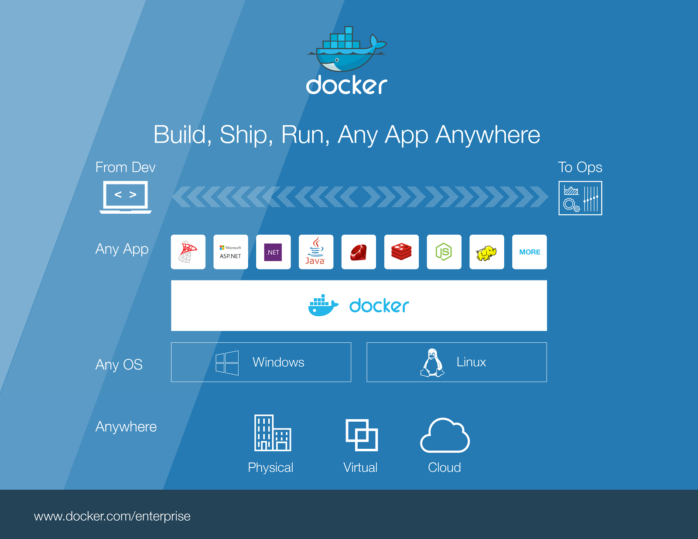
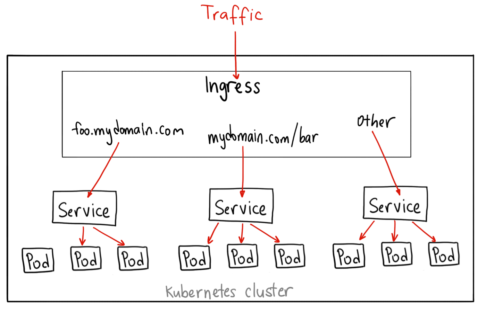

# Build Ship & Run

## 基于 Docker 的 CI/CD 工作流

---

<!-- .element: height="618" -->

---

## Build（构建镜像）

--

### Dockerfile - 描述构建步骤

```dockerfile []
FROM node:12

WORKDIR /usr/src/app

COPY package*.json ./

RUN npm install

COPY . .

EXPOSE 8080

CMD ["node", "server.js"]
```
<!-- .element: style="width: 400px;" -->

<sup>\*</sup> https://nodejs.org/en/docs/guides/nodejs-docker-webapp/

<!-- .element: style="font-size: .5em;" -->

--

### Dockerfile 常用指令

<ul>
  <li class="fragment" data-fragment-index="0"><strong>FROM</strong> 指定基础镜像。是 Dockerfile 中必备的指令，并且必须在第一条。</li>
  <li class="fragment" data-fragment-index="1"><strong>WORKDIR</strong> 指定工作目录。如目录不存在会自动创建。</li>
  <li class="fragment" data-fragment-index="2"><strong>COPY</strong> 复制文件。</li>
  <li class="fragment" data-fragment-index="3"><strong>RUN</strong> 执行命令。</li>
  <li class="fragment" data-fragment-index="4"><strong>EXPOSE</strong> 暴露端口。仅用作声明，并不会在容器运行时自动进行映射。</li>
  <li class="fragment" data-fragment-index="5"><strong>CMD</strong> 容器启动命令。可以在容器启动时被覆盖。</li>
</ul>

--

### docker build - 执行构建

```bash
# docker build [OPTIONS] CONTEXT
docker build -t hello-world .
```

<ul>
  <li><strong>CONTEXT</strong> 镜像构建上下文。在镜像构建过程中只能使用上下文中的文件，因此形如 <code>COPY ../foo .</code> 的命令是无法运行的。</li>
  <li><strong>--file , -f</strong> 指定构建使用的 Dockerfile。缺省情况下会使用 CONTEXT 中的 Dockerfile 文件。</li>
  <li><strong>--tag , -t</strong> 定义镜像的名称和 Tag，形式为 名称:Tag。</li>
</ul>

--

### docker images - 列出镜像

```bash
# docker images [OPTIONS] [REPOSITORY[:TAG]]
docker images
```

### docker history - 查看镜像内容

```bash
# docker history [OPTIONS] IMAGE
docker history hello-world
```

---

## Ship（分发镜像）

--

### Registry（镜像仓库）

+ 公共仓库（hub.docker.com）
+ 私有仓库

--

### docker login - 登录 registry

```bash
# docker login [OPTIONS] [SERVER]
docker login registry.llsops.com
```
<!-- .element: style="width: 500px;" -->

--

### Tag Image → Push Image

```bash
# example：从公共仓库下载一个镜像并推送到私有仓库

# docker pull [OPTIONS] NAME[:TAG|@DIGEST]
docker pull node:15

# docker tag SOURCE_IMAGE[:TAG] TARGET_IMAGE[:TAG]
docker tag node:15 registry.llsops.com/library/node:15

# docker push [OPTIONS] NAME[:TAG]
docker push registry.llsops.com/library/node:15
```

---

## Run（运行镜像）

--

### 容器

容器的本质是一组被隔离的进程，在 linux 中通过以下技术实现进程隔离：

+ chroot（文件系统隔离）
+ namespace（视图隔离）
+ cgroup（资源隔离）

--

### docker run - 启动容器

```bash
# docker run [OPTIONS] IMAGE [COMMAND] [ARG...]
docker run -d -p 8080:8080 --name hello-world-container hello-world
```

+ **--detach , -d** 在后台运行容器
+ **--publish , -p** 映射容器端口
+ **--name** 指定容器名称
+ **--interactive , -i** 保持 STDIN 开启
+ **--tty , -t** 分配虚拟终端

--

### docker ps - 查看运行中的容器

```bash
# docker ps [OPTIONS]
docker ps
```

### docker stop - 终止容器

```bash
# docker stop [OPTIONS] CONTAINER [CONTAINER...]
docker stop hello-world-container
```

### docker rm - 删除容器

```bash
# docker rm [OPTIONS] CONTAINER [CONTAINER...]
docker rm hello-world-container
```

---

## 容器编排

--

### 容器编排解决了什么问题？

<ul>
  <li class="fragment" data-fragment-index="0">自动部署与回滚</li>
  <li class="fragment" data-fragment-index="1">副本管理与故障恢复</li>
  <li class="fragment" data-fragment-index="2">自动装箱计算</li>
  <li class="fragment" data-fragment-index="3">服务发现与负载均衡</li>
  <li class="fragment" data-fragment-index="4">配置管理</li>
</ul>

--

### Kubernetes 的基础架构
<!-- .slide: data-background="#ffffff" -->


--

### Kubernetes 的基础概念

+ Pod：Kubernetes 中最小的调度单元，每个 Pod 拥有一个集群私有 IP 地址，Pod 之前可以通过这个 IP 地址互相调用。
+ Service：一组 Pod 的集合，提供统一的 IP 和 Port 以在多个 Pod 之间实现负载均衡。
+ Ingress：将集群外部流量路由到 Service，并提供集群之间的负载均衡、SSL 剥离等功能。

--

### Pod Service Ingress 关系

<!-- .element: height="600" -->

---

## Q&A
